# API DE YOUTUBE - RUBY ON RAILS
**Integrantes**
* Jose Herrera Aristizabal - T00041331
* Edgar Calderón Padrón - T00049682
* Maria Camila Villamizar Hernández - T00049721  
**Profesor**  
Jairo Enrique Serrano  
**Institución**  
Universidad Tecnológica de Bolívar  
**Fecha**  
Noviembre de 2019  

# 1. Instalación de Ruby on Rails
Lo primero que debemos hacer es instalar el entorno virtual ejecutando los siguientes comandos en la terminal:  

Se actualiza la máquina por medio de la línea de comando:  
*```sudo apt update```*  

Posterior a esto se instalan las dependencias requeridas para la instalación de Ruby  
*```sudo apt install autoconf bison build-essential libssl-dev libyaml-dev libreadline6-dev zlib1g-dev libncurses5-dev libffi-dev libgdbm5 libgdbm-dev```*  

Para la instalación de Ruby se presentan dos opciones que son *“rbenv”* y *“rvm”*, en este caso optamos por *“rbenv”* por lo cual nos ubicamos dentro de la carpeta y clonamos el repositorio de git con el comando:  
*```git clone https://github.com/rbenv/rbenv.git ~/.rbenv```*  

Agregamos la dirección de la carpeta *~/.rbenv/bin* a nuestras variables de entorno por medio de la línea de comando:  
*```echo 'export PATH="$HOME/.rbenv/bin:$PATH"' >> ~/.bashrc```*  

Se agrega el comando eval *"$(rbenv init -)"* al archivo *~/.bashrc* para que *rbenv* cargue automáticamente:  
*```echo 'eval "$(rbenv init -)"' >> ~/.bashrc```*  

Se aplican los cambios con el comando:  
*```source ~/.bashrc```*  

Se verifica si *“rbenv”* se encuentra instalado por medio de la línea de comando:  
*```type rbenv```*  

Se instala desde git *“ruby-build”* para simplificar la instalación de las versiones de ruby por medio del comando *“rbenv”*  
*```git clone https://github.com/rbenv/ruby-build.git ~/.rbenv/plugins/ruby-build```*  

Finalizada la configuración del comando *“rbenv”* proseguimos con la instalación de Ruby, para eso utilizamos el siguiente comando que nos enlista las distintas versiones disponibles de Ruby:  
*```rbenv install -l```*  
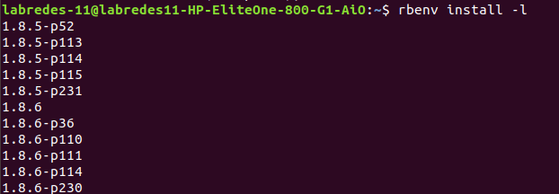  

Se escoge la versión más reciente y se usa la línea de comando presentada a continuación, variando el número de la versión a utilizar:  
*```rbenv install 2.6.5```*  
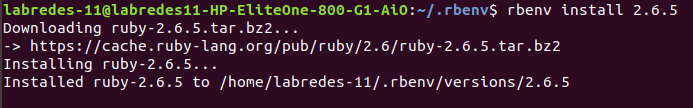  

Se define la versión instalada como la versión a utilizar en la máquina:  
*```rbenv global 2.6.5```*  

Para verificar la instalación de la versión escogida se hace uso de la línea de comando:  
*```ruby -v```*  
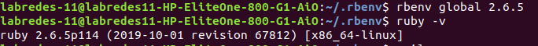  

Con este proceso se puede dar por terminada la instalación de ruby y proseguimos con la configuración para la instalación de Ruby on Rails, comenzamos con la instalación de *“blunder”* que es una herramienta para la instalación de dependencias de Rails, esto por medio de la siguiente línea de comando:  
*```gem install bundler```*  

Se define un entorno virtual de instalación por medio de la línea de comando:  
*```gem env home```*  

Finalizada la configuración previa se procede con la instalación de Ruby on Rails con la siguiente línea:  
*```gem install rails -v 5.2.0```*  

Se puede definir la versión a usar, como se muestra anteriormente, o simplemente instalar la version mas reciente, asi:  
*```gem install rails```*  

*rbenv* funciona creando un directorio de *“shims”*, que apuntan a los archivos utilizados por la versión de Ruby que está habilitada actualmente. A través del subcomando rehash, rbenv mantiene *“shims”* en ese directorio para que coincida con cada comando de Ruby en todas las versiones instaladas de Ruby en su servidor. Siempre que instales una nueva versión de Ruby o una gema que proporcione comandos, como lo hace Rails, debes ejecutar:  
*```rbenv rehash```*  

Se verifica la instalación de rails por medio del comando:  
*```rails -v```*  

Es necesario instalar Node, por lo que usamos los siguientes comandos:  
*```sudo apt install nodejs```*  

A continuación ejecutamos los siguientes comandos para instalar *sqlite3* y poder usar una base de datos  
*```sudo apt-get install libsqlite3-dev```*  
*```gem install sqlite3 -v 1.3.11```*  

Ahora creamos una carpeta y ejecutamos el comando *rails new apiYoutube --api* para crear la estructura correspondiente del proyecto y quedará listo para usarlo como una API.  
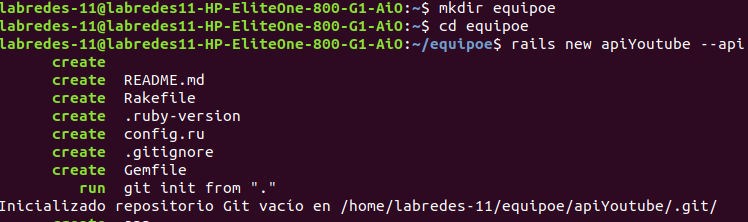  

Realizamos una prueba para ver si el servidor está funcionando. Para esto ejecutamos   
*```rails server```*  
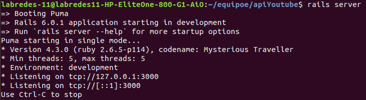  

Al entrar al localhost debe verse algo como esto:  
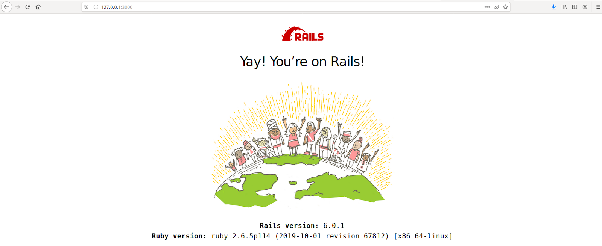  

# 2. Generando la llave de la API de YouTube
Es necesario tener una cuenta de google para realizar el siguiente paso, en el que se debe entrar a la consola de la API, para esto ingresamos a *code.google.com/apis/console*. Se le da clic a crear proyecto. En nuestro caso el nombre que se le asignó al proyecto fue “Api de Youtube” . Posteriormente, seleccionamos el proyecto creado.  

A continuación en el menú de la derecha seleccionamos *“biblioteca”* y buscamos la api de youtube que necesitamos, como se muestra a continuación.  
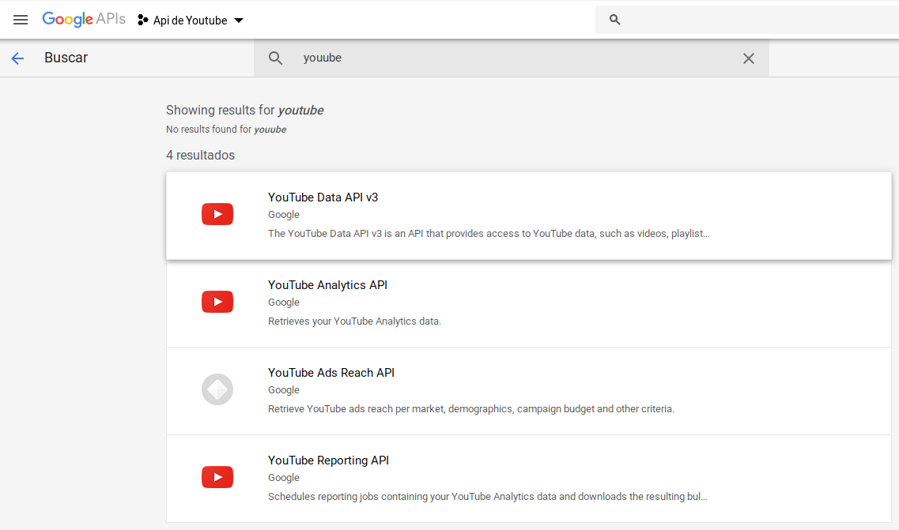  

En nuestro caso seleccionamos la api *“YouTube Data API v3”* y se le da clic en el botón habilitar.  
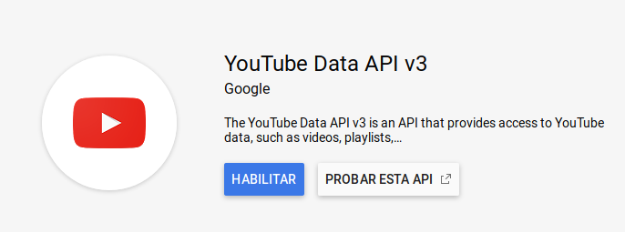  

A continuación saldrá una pantalla con la respectiva información de dicha API.  
En el menú de la izquierda seleccionamos credenciales y hacemos clic en donde dice *“Credenciales en APIs y servicios”*  
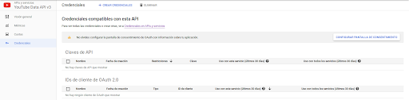  

A continuación seleccionamos *“Crear credenciales”* en la opción *“ID de cliente de QAuth”*  
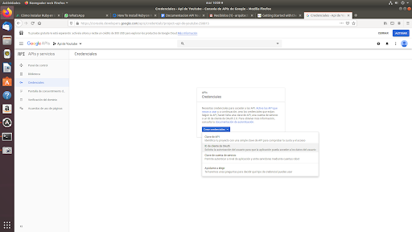  

Seleccionamos el botón a la derecha que dice *“Configurar pantalla de autorización”*  
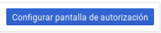  

A continuación procedemos a digitar el nombre de nuestra aplicación. En nuestro caso le pusimos *“Api de Youtube”* y seleccionamos en *“Guardar”*.  
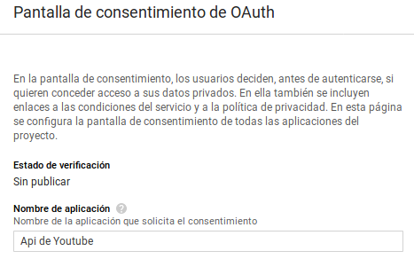  

Luego de esto seleccionamos *“Otro”* y *“Crear”*. Luego descargamos el JSON oprimiendo en el botón de descarga  
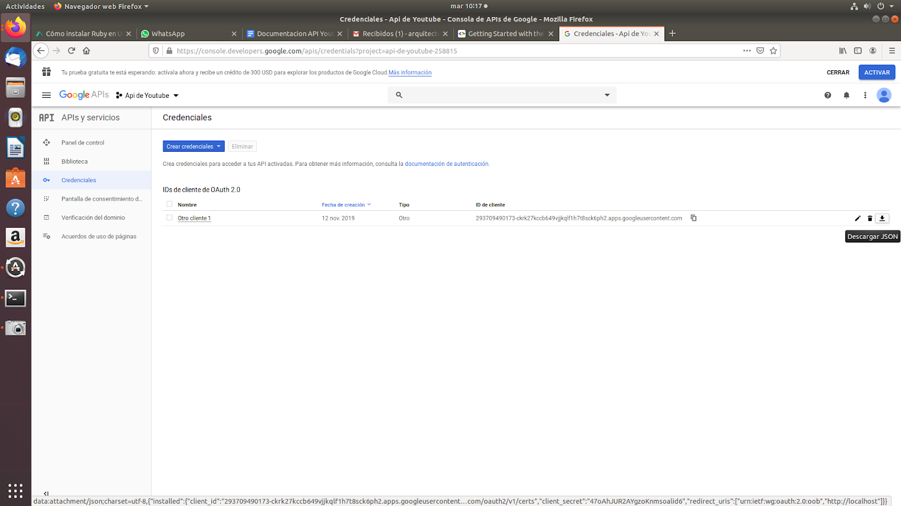  

Creando el siguiente archivo  
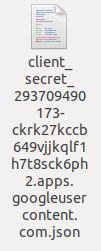  

# 3. Instalación de la librería del cliente de Google.
Para poder continuar debemos instalar las librerias de google. Para eso ejecutamos en la terminal el siguiente comando:  
*```gem install google-api-client```*  

# 4. Creación de los controladores
Para poder realizar el proceso de autenticación y autorización debemos hacer uso del archivo json descargado anteriormente, cambiamos el nombre a *"client_secret.json"* de la siguiente manera:  
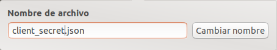  

Y a continuación movemos este archivo al directorio de trabajo, en nuestro caso a apiYoutube.  
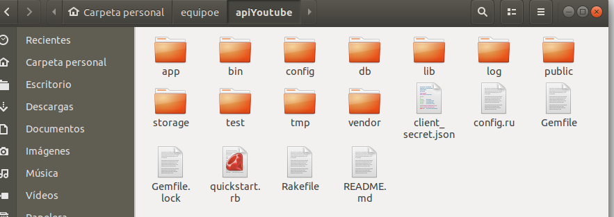  

Para crear los controladores, modelos y la estructura de la base de datos, de las peticiones especificadas, se hace uso del siguiente comando:   
*```rails generate scaffold Post id likes:integer efficiency:float user```*  

Donde por defecto las variables son de tipo *“string”* y se especifica su tipo en caso contrario. Al ejecutarlo, definiendo las variables a obtener en **Post**, obtenemos lo siguiente:  
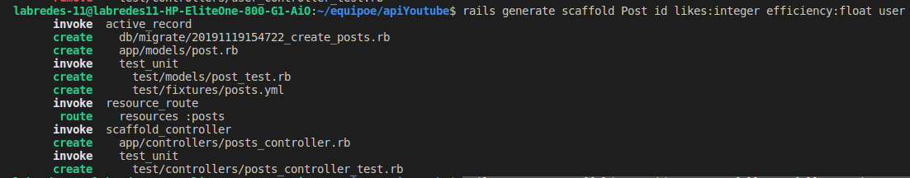  
*```rails generate scaffold User id username fullname followers:integer posts:integer```*  

Al ejecutarlo, definiendo las variables a obtener en **User**, obtenemos lo siguiente:  
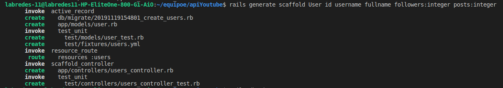  

Al ejecutar los comandos presentados anteriormente se crean los archivos necesarios para la obtención y almacenamiento de la información. Los archivos de creación de la base de datos quedarían de la siguiente manera:  
![][1] ![][2]  
[1]:img_README/19.png  
[2]:img_README/20.png  

Una vez hecho esto se realiza el siguiente comando   
*```rails db:migrate```*  
**_Sin hacer uso del comando anterior es imposible la correcta ejecución o puesta en marcha del servidor_**  

Los controladores son creados abarcando todas las posibles peticiones que puedan realizarse, terminando de la siguiente manera:  
![][1] ![][2]  
[1]:img_README/21.png  
[2]:img_README/22.png  

# 5. Modificación de los controladores
A continuación procedemos a crear un archivo en el que almacenaremos las funciones necesarias para la obtención de la información de la API de Youtube, este estará ubicado en el directorio “controllers”. En nuestro caso lo llamamos “funciones.rb”  
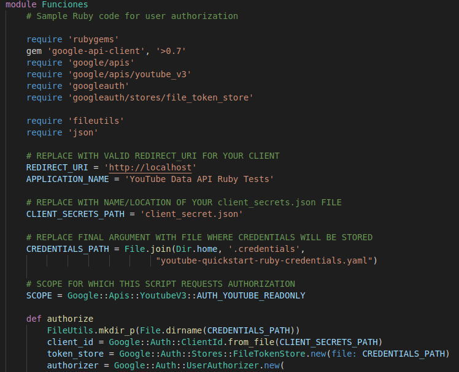  

En dicho archivo, creamos las siguientes funciones:  
* **authorize**: Se encarga del proceso de petición de permisos, necesario para la utilización de la API de Youtube.  
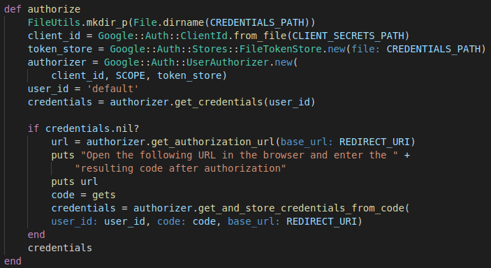  
* **channel_list_by_username**: Obtiene la información de un usuario, a partir de la identificación del canal.  
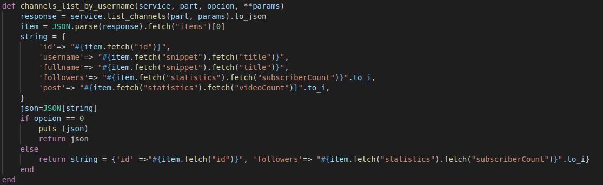  
* **videoinfo**: Obtiene la información de un video, a partir de la identificación del video.  
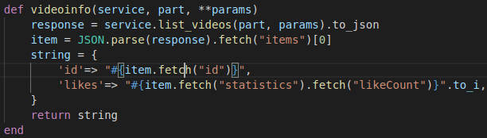  
* **videolist**: Obtiene la identificación de video de los últimos videos publicados por un usuario, posterior a eso se pasa el identificador a la función anterior para retornar la información necesaria por la aplicación.  
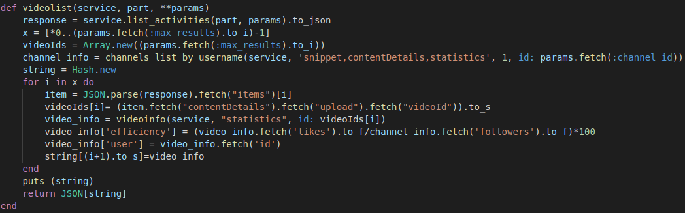  
* **search_by_username**: Hace uso de la función *“channel_list_by_username”* para obtener la información de un usuario a partir del nombre dentro de la aplicación.  
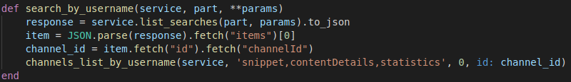  
* **search_id**: Obtiene el identificador dentro de la aplicación a partir de un nombre de usuario.  
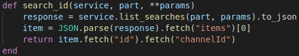  

Procedemos con la modificación de los controladores creados anteriormente. Importamos el archivo con las funciones, por medio de *“require”* y nuestra clase en el controlador heredara las funciones de este archivo por medio de  *“include”* donde se especifica el nombre del módulo ha usar, que se encuentra en el archivo.  
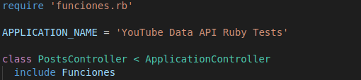  

Una vez realizado esto ya se obtiene un json con la información necesaria al realizar una petición GET.  

# 6. Pruebas
Para probar el funcionamiento del programa se ingresó la siguiente URL en la herramienta *“Postman”*:  
*```localhost:3000/posts?username=&cant=5&channel_id=UC_x5XG1OV2P6uZZ5FSM9Ttw```*

Con este se verifica que la obtención de los números de publicaciones, que se encuentra definido por la variable *“cant”*, del canal, definido por *“username”* o *“channel_id”*, se de correctamente. Al ingresar la URL se obtiene lo siguiente:  
```
{  
    "1": {  
        "id": "0fj7avs9k4Q",  
        "likes": 91,  
        "efficiency": 0.004642857142857143,  
        "user": "0fj7avs9k4Q"  
    },  
    "2": {  
        "id": "gO_Lurqe08M",  
        "likes": 184,  
        "efficiency": 0.009387755102040816,  
        "user": "gO_Lurqe08M"  
    },  
    "3": {  
        "id": "b6bYzgsBK_I",  
        "likes": 14,  
        "efficiency": 0.0007142857142857143,  
        "user": "b6bYzgsBK_I"  
    },  
    "4": {  
        "id": "74p7a2PmKok",  
        "likes": 4,  
        "efficiency": 0.0002040816326530612,  
        "user": "74p7a2PmKok"  
    },  
    "5": {  
        "id": "d6jZUYjHaWI",  
        "likes": 7,  
        "efficiency": 0.00035714285714285714,  
        "user": "d6jZUYjHaWI"  
    }  
}  
```  

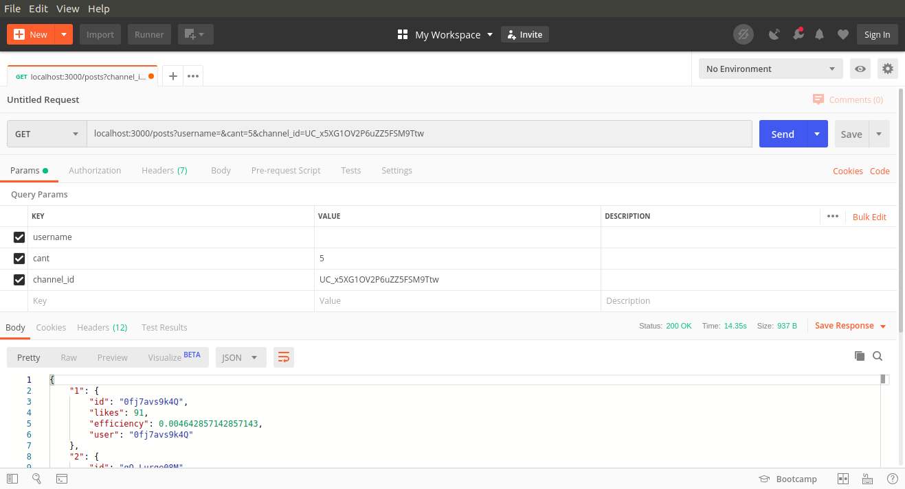  

Proseguimos con la prueba de la información en función del nombre de usuario, por lo que ingresamos la siguiente URL:  
*```localhost:3000/users?username=Google Developer```*  

Con este se verifica que la obtención de los números de publicaciones, que se encuentra definido por la variable *“cant”*, del canal, definido por *“username”* o *“channel_id”*, se de correctamente. Al ingresar la URL se obtiene lo siguiente:  

```  
{  
    "id": "UC_x5XG1OV2P6uZZ5FSM9Ttw",  
    "username": "Google Developers",  
    "fullname": "Google Developers",  
    "followers": 1960000,  
    "post": 5108  
}  
```  

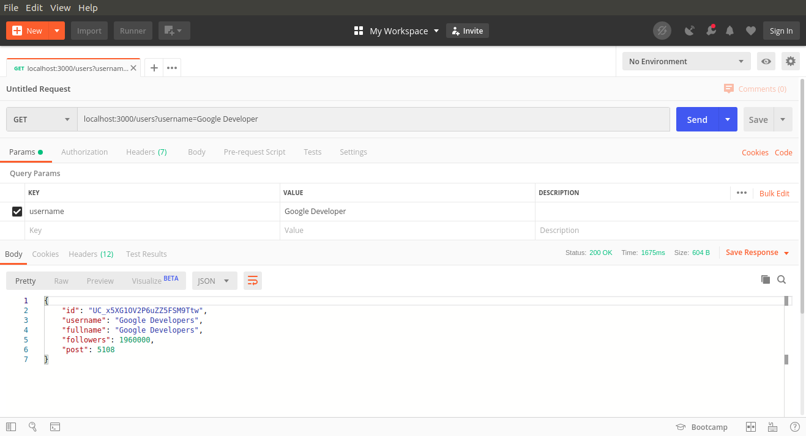  

# BIBLIOGRAFÍA:
https://www.digitalocean.com/community/tutorials/how-to-install-ruby-on-rails-with-rbenv-on-ubuntu-18-04
https://developers.google.com/youtube
https://developers.google.com/youtube/v3/getting-started
https://developers.google.com/youtube/v3/code_samples/ruby
https://developers.google.com/sheets/api/quickstart/ruby
https://rubygems.org/gems/sqlite3/versions/1.3.11?locale=es
https://developers.google.com/youtube/v3/quickstart/ruby
https://ruby-doc.org/core-2.4.0/Hash.html#method-i-transform_values-21
https://www.rubydoc.info/github/google/google-api-ruby-client/Google/Apis/YoutubeV3/YouTubeService
https://freivincampbell.github.io/blog/mi-primer-api-con-ruby-on-rails/
